## 3D Models

Note: All parts were designed to be printed without the need for any support

### Assembly 1. Body
This is the central part of the bot, technically called the  tetrapod torso. It is basically the body of an animal without the 4 shoulders, limbs, head or buttock.

- It contains all the electronic components including the battery, except the LCD and the servos.
- Technically, the SBEC Cover and the Board Cover are optional. They can be skipped for now and printed at the end

|Assembly No|Assembly Name|Part|File Path|Count|Image||
|--|--|--|--|--|--|--|
|1|Body|Plate|body/plate.stl|x1|||
|1|Body|Side|body/side.stl|x2|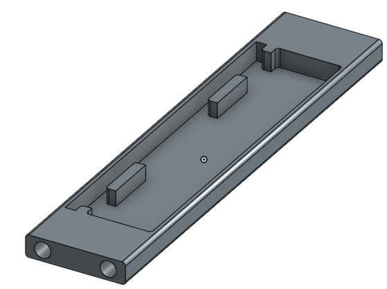||
|1|Body|Battery Cover|body/battery-cover.stl|x1|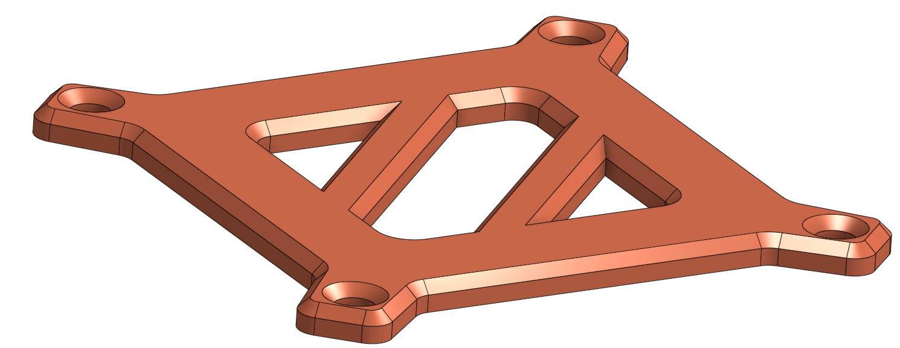|optional|
|1|Body|SBEC Cover|body/sbec-cover.stl|x1|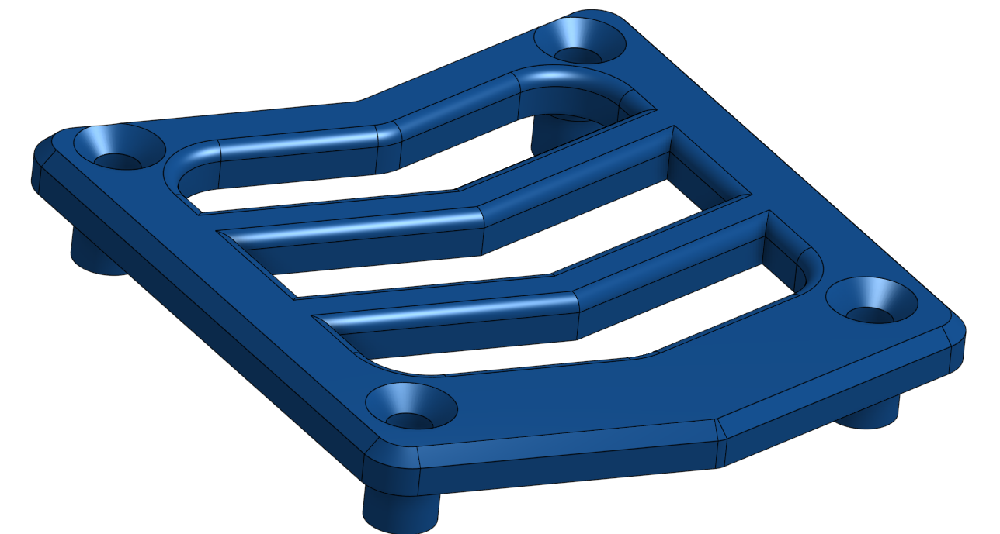|optional|
|1|Body|Boards Cover|body/boards-cover.stl|x1|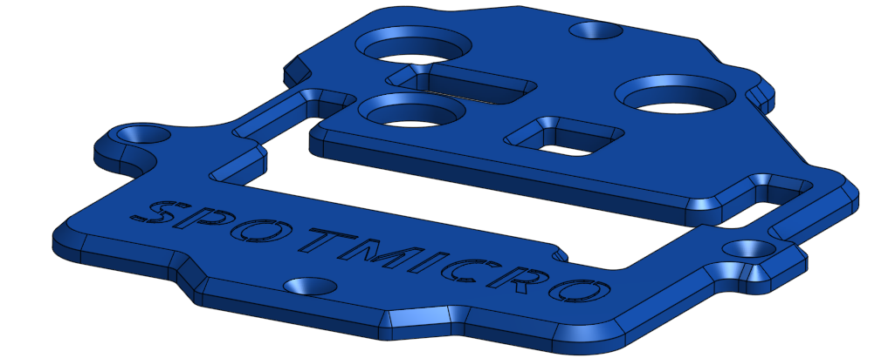|optional|

### Assembly 2. Front/Rear Shoulders

- This assembly is the shoulders cage that holds the Z-axis servos
- You will need two copies of this assembly
- Note that the limbs of the rear shoulders are reverse when compared to the front shoulders (left is right and right is left). More on that later

|Assembly No|Assembly Name|Part|File Path|Count|Image||
|--|--|--|--|--|--|--|
|2|Front/Rear Shoulders|Inner Shoulder Plate|shoulders/inner-plate/inner-shoulder-plate.stl|x2|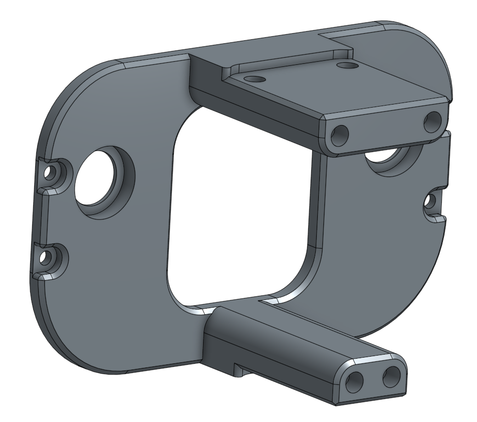|
|2|Front/Rear Shoulders|Left Shoulder Limb Cover|shoulders/limb/left/left-shoulder-limb-cover.stl|x2|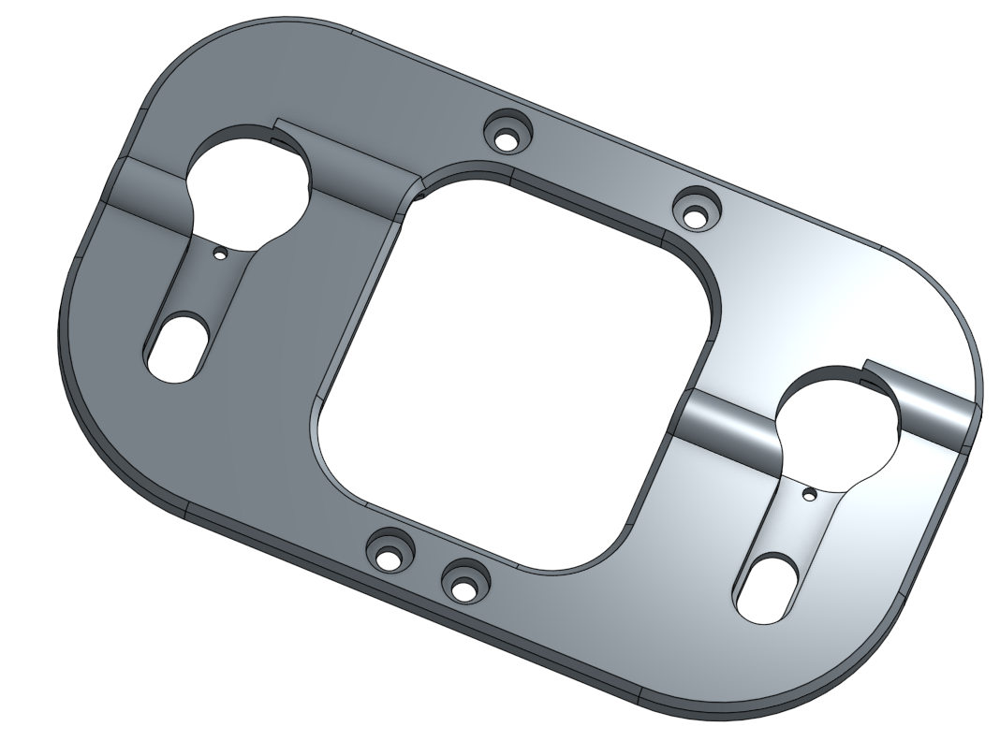|
|2|Front/Rear Shoulders|Left Shoulder Limb|shoulders/limb/left/left-shoulder-limb.stl|x2|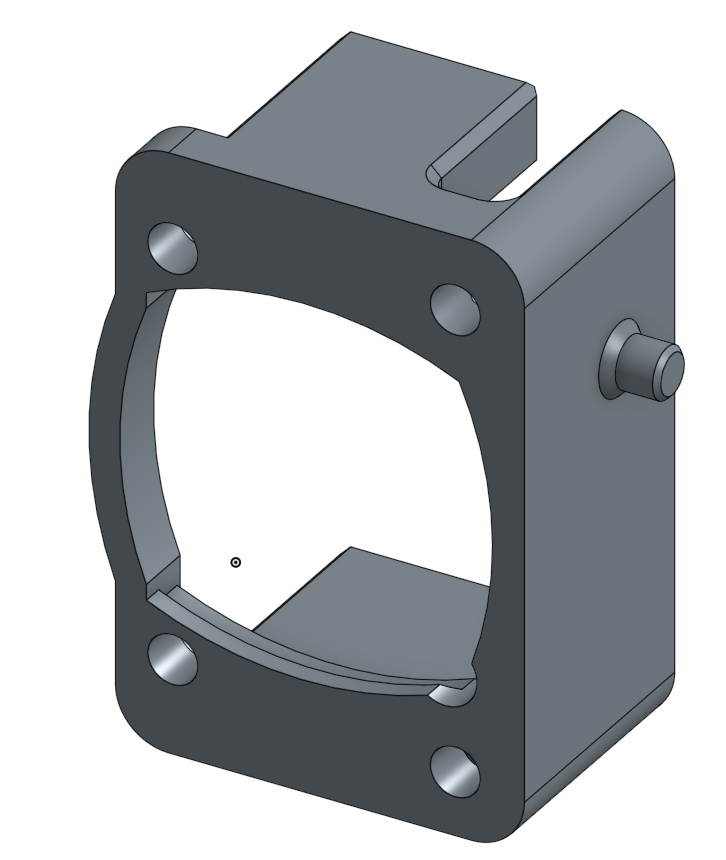|
|2|Front/Rear Shoulders|Right Shoulder Limb Cover|shoulders/limb/right/right-shoulder-limb-cover.stl|x2|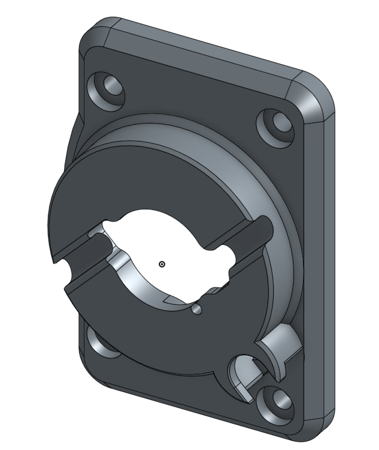|
|2|Front/Rear Shoulders|Right Shoulder Limb|shoulders/limb/right/right-shoulder-limb.stl|x2|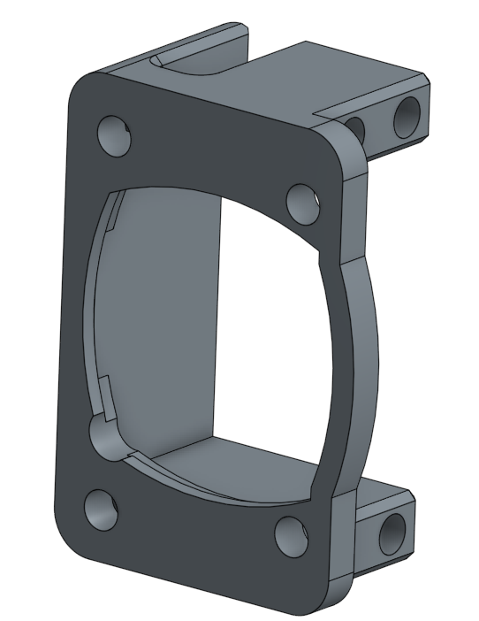|
|2|Front/Rear Shoulders|Outer Shoulder Plate|shoulders/outer-plate/outer-shoulder-plate.stl|x2|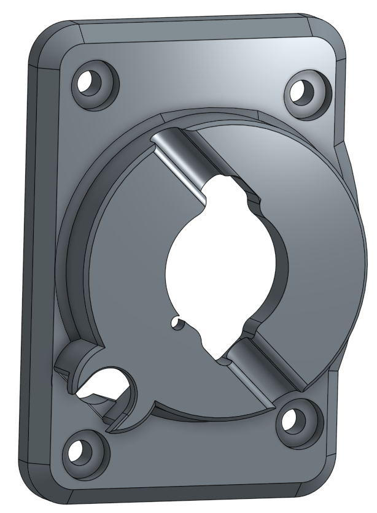|

### Assembly 3. Left Leg
|Assembly No|Assembly Name|Part|File Path|Count|Image||
|--|--|--|--|--|--|--|
|3|Left Leg|Shoe|legs/shoe.stl|x2|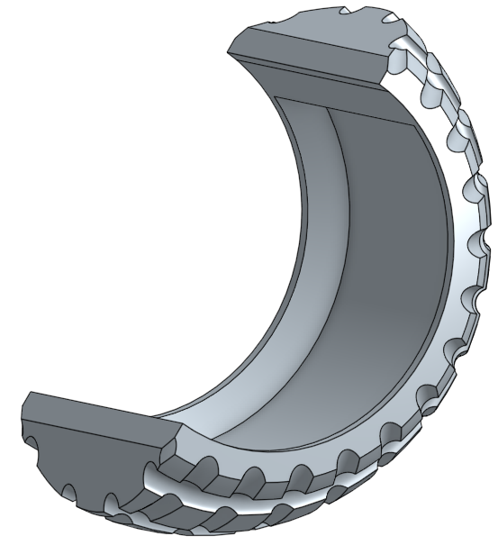|
|3|Left Leg|Left Foot Base|legs/left/foot/left-foot-base.stl|x2|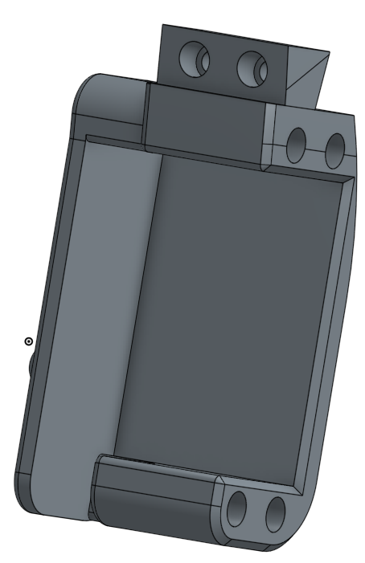|
|3|Left Leg|Left Foot Inner|legs/left/foot/left-foot-inner.stl|x2|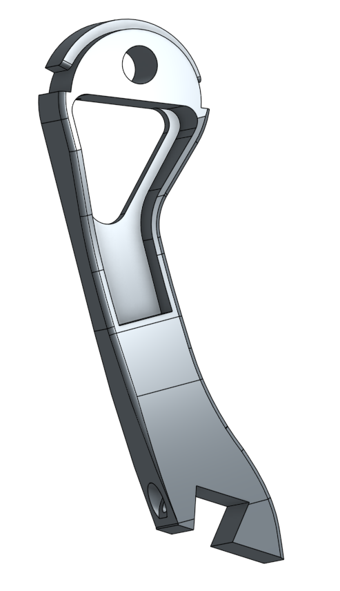|
|3|Left Leg|Left Foot Outer|legs/left/foot/left-foot-outer.stl|x2|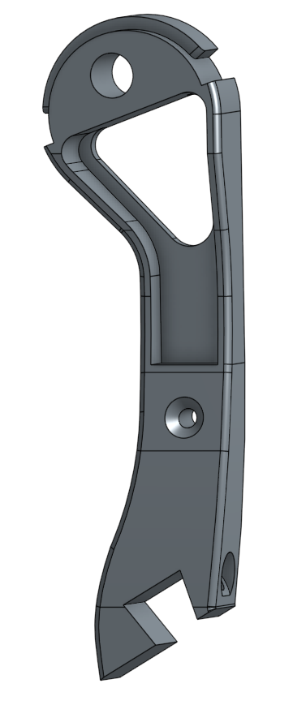|
|3|Left Leg|Bearing End|legs/left/leg/bearing-end.stl|x2|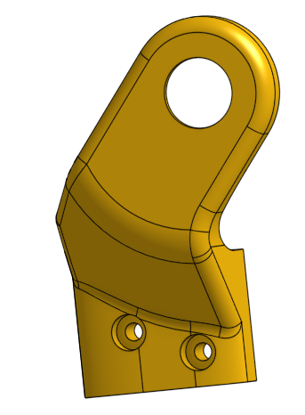|
|3|Left Leg|Cover|legs/left/leg/cover.stl|x2|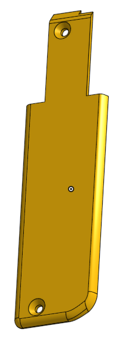|
|3|Left Leg|Left Leg|legs/left/leg/left-leg.stl|x2|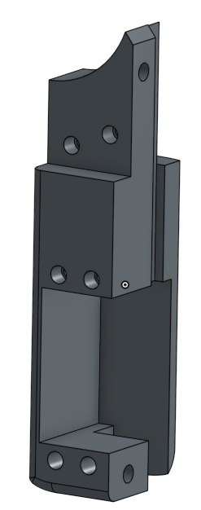|
|3|Left Leg|Servo End|legs/left/leg/servo-end.stl|x2|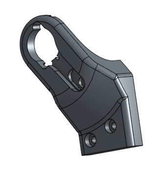|

### Assembly 4. Right Leg
|Assembly No|Assembly Name|Part|File Path|Count|Image||
|--|--|--|--|--|--|--|
|4|Right Leg|Shoe|legs/shoe.stl|x2||
|4|Right Leg|Right Foot Base|legs/right/foot/right-foot-base.stl|x2|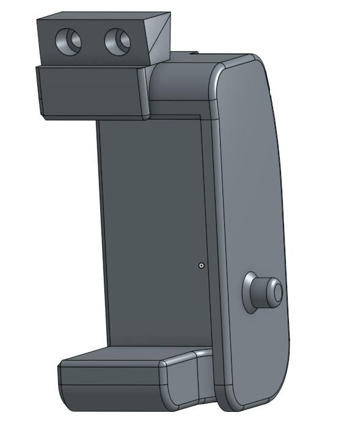|
|4|Right Leg|Right Foot Inner|legs/right/foot/right-foot-inner.stl|x2|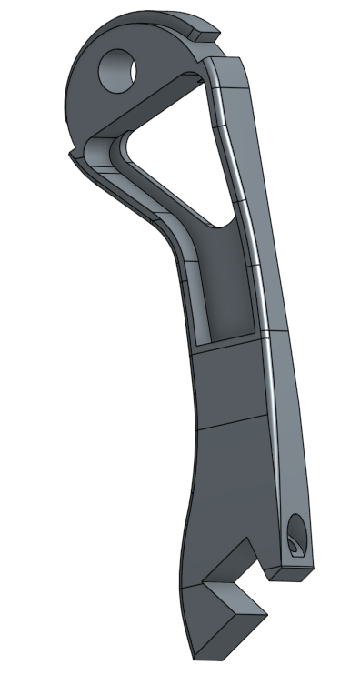|
|4|Right Leg|Right Foot Outer|legs/right/foot/right-foot-outer.stl|x2||
|4|Right Leg|Bearing End|legs/right/leg/bearing-end.stl|x2|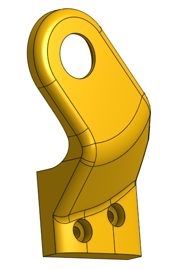|
|4|Right Leg|Cover|legs/right/leg/cover.stl|x2|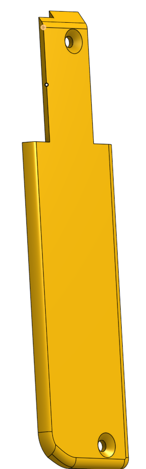|
|4|Right Leg|Right Leg|legs/right/leg/right-leg.stl|x2|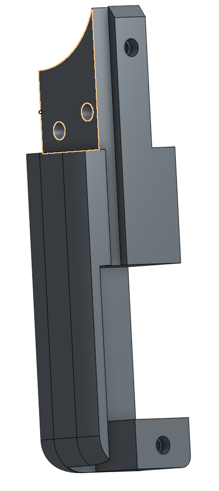|
|4|Right Leg|Servo End|legs/right/leg/servo-end.stl|x2|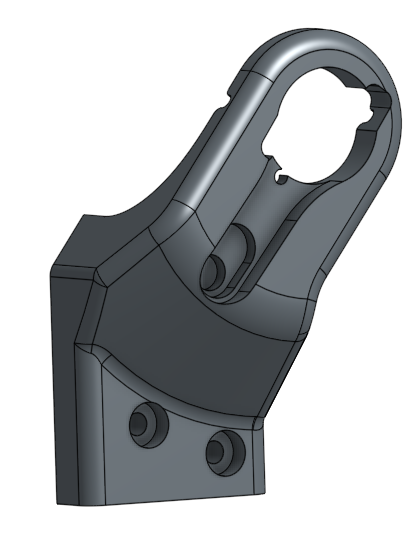|

### Assembly 5. Top & Bottom Covers
Two very similar parts that wrap the body (the previous assembly). One cover goes on the top and the other on the bottom.

- The top cover has two openings, one for a power switch and another for accessing the battery charging connector
- The bottom cover has two optional parts that I call "offsets". They maybe needed if extra room is desired.

|Assembly No|Assembly Name|Part|File Path|Count|Image||
|--|--|--|--|--|--|--|
|5|Top/Bottom Covers|Bottom Panel|bottom/bottom-panel.stl|x1|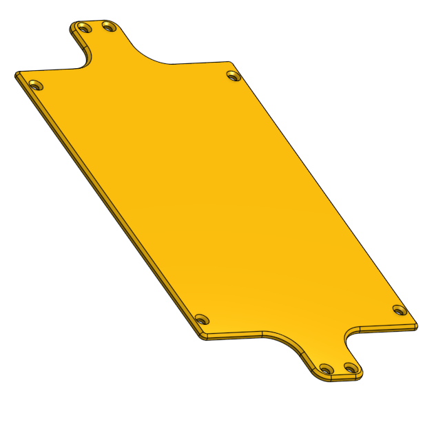|
|5|Top/Bottom Covers|Edge Panel Connector|bottom/edge-panel-connector.stl|x4|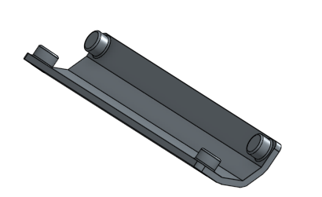|
|5|Top/Bottom Covers|Left Side Panel|bottom/left-side-panel.stl|x2|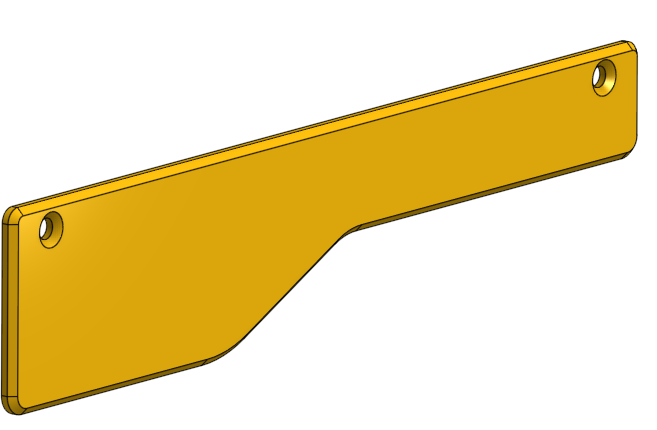|
|5|Top/Bottom Covers|Offset|bottom/offset.stl|x2|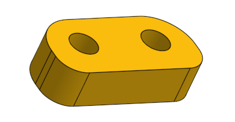|
|5|Top/Bottom Covers|Right Side Panel|bottom/right-side-panel.stl|x2||
|5|Top/Bottom Covers|Charging Cover|top/charging-cover.stl|x1|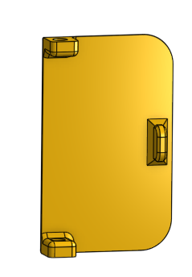|
|5|Top/Bottom Covers|Top Cover with Opening|top/top-cover-with-opening.stl|x1|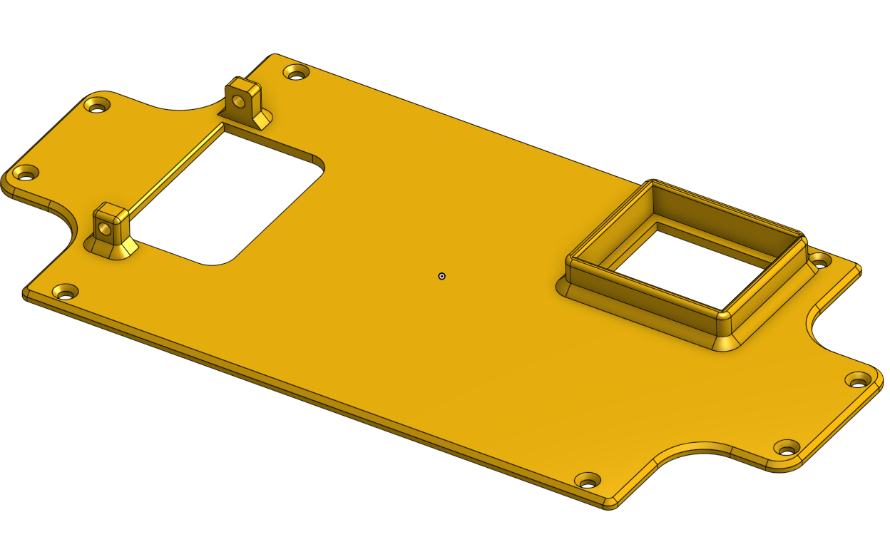|

### Assembly 6. Head
|Assembly No|Assembly Name|Part|File Path|Count|Image||
|--|--|--|--|--|--|--|
|6|Head|Connector|head/connector.stl|x1|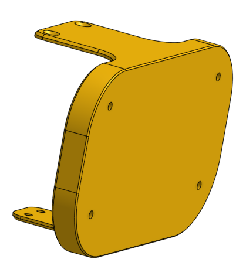|
|6|Head|Face|head/face.stl|x1|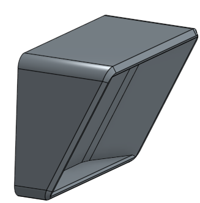|
|6|Head|Middle|head/middle.stl|x1|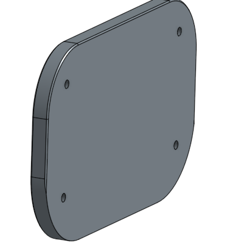|
|6|Head|Nose|head/nose.stl|x1|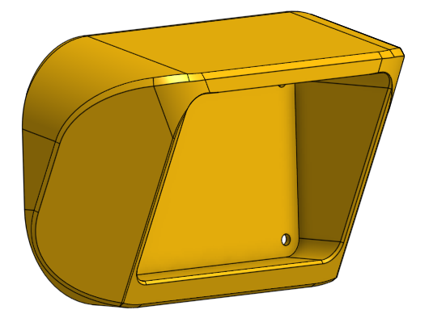|

### Assembly 7. Rear
|Assembly No|Assembly Name|Part|File Path|Count|Image||
|--|--|--|--|--|--|--|
|7|Rear|Rear Cover|rear/rear-cover.stl|x2|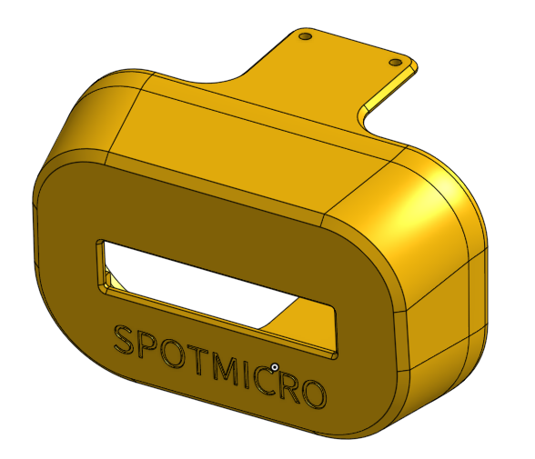|

### Assembly 8. Stand

- Technically, this assembly is optional, but it is very difficult to calibrate and test the robot without it

|Assembly No|Assembly Name|Part|File Path|Count|Image||
|--|--|--|--|--|--|--|
|8|Stand|Base|stand/base-x-2.stl|x2||
|8|Stand|Cross Beam|stand/cross-beam-x-2.stl|x2|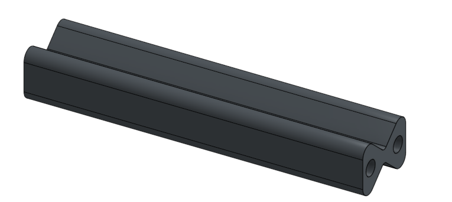|
|8|Stand|Foot|stand/foot-x-4.stl|x4|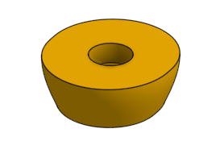|
|8|Stand|Fork|stand/fork-x-2.stl|x2|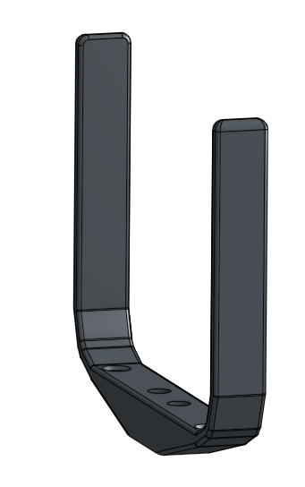|
|8|Stand|Stem|stand/stem-x-2.stl|x2|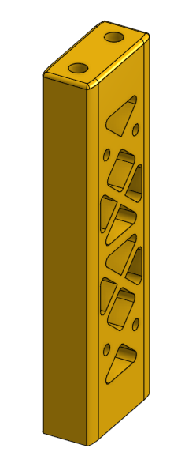|