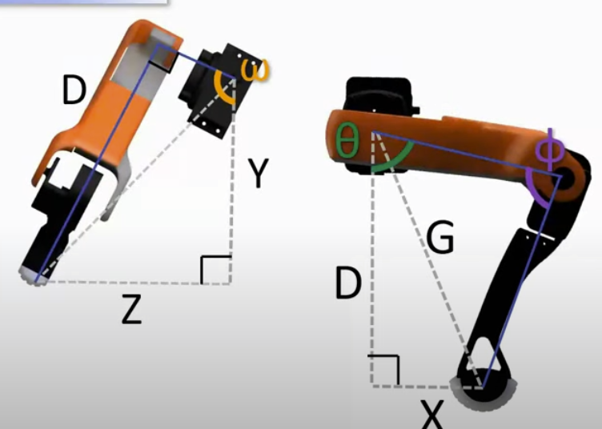

# Inverse Kinematics Analysis for SpotMicro Leg

This document outlines the derivation of the inverse kinematics equations for a 3-DOF robotic leg, based on the provided system parameters.

## 1. System Definition

### Coordinate System
- **X-Axis**: Forward/Backward (positive towards the back)
- **Y-Axis**: Up/Down (positive downwards)
- **Z-Axis**: Sideways (positive to the right)

### Link Lengths
- `L3`: Length from shoulder joint `p1` to hip joint `p2`. `L3 = 54 mm`.
- `L1`: Length from hip joint `p2` to knee joint `p3`. `L1 = 110 mm`.
- `L2`: Length from knee joint `p3` to the foot/tool `t`. `L2 = 130 mm`.

### Joint Angle Definitions
- **ω (omega)**: Shoulder Abduction/Adduction. Rotation at `p1` around the X-axis.
  - `ω = 0°` when the leg points straight down (in the XY plane).
  - `ω = 90°` when the leg points straight out to the right (in the XZ plane).
- **θ (theta)**: Hip Flexion/Extension. Rotation at `p2` in the leg's 2D plane.
  - `θ = 0°` when the femur (L1) points straight down.
  - `θ = 90°` when the femur points backward, parallel to the X-axis.
- **φ (phi)**: Knee Flexion/Extension. The internal angle at `p3` between the femur (L1) and tibia (L2).

## 2. Inverse Kinematics Derivation

The goal is to find the joint angles `(ω, θ, φ)` for a given target foot position `t(x, y, z)`. This derivation is based on the key constraint that the coxa link (L3) is always orthogonal to the vector from the hip joint (p2) to the foot (t). This means the triangle formed by p1-p2-t is a right-angled triangle at p2.

### Step 1: Calculate Shoulder Angle (ω)

The right-angle constraint means the dot product of the vector from the shoulder to the hip (`v_p1_p2`) and the vector from the hip to the foot (`v_p2_t`) is zero. This gives the equation:
`y*cos(ω) + z*sin(ω) = L3`

This can be solved for `ω` using trigonometric identities. The solution involves two angles:
1.  `α`: The angle of the target point in the YZ plane: `α = atan2(y, z)`
2.  `β`: An angle derived from the right-triangle in the YZ plane: `β = acos(L3 / sqrt(y² + z²))`

This gives two possible solutions for `ω`, representing different leg configurations. We select one for the formula.

**Formula for ω:**
```
ω = atan2(y, z) - acos(L3 / sqrt(y² + z²))
```

### Step 2: Transform to the Leg's 2D Plane

With `ω` known, we simplify the problem to 2D by calculating the foot's coordinates relative to the hip joint `p2`.

The target coordinates in the leg's 2D frame, `(x_leg, y_leg)`, are:
- **`x_leg`**: The forward/backward component is unaffected by rotation around the X-axis.
  `x_leg = x`
- **`y_leg`**: Because of the right-angle constraint, this effective downward distance can be found using the Pythagorean theorem in 3D space.
  `y_leg = sqrt(x² + y² + z² - L3²)`

### Step 3: Solve the 2D IK for Hip (θ) and Knee (φ) Angles

Now we have a standard 2D inverse kinematics problem for a two-link arm (`L1` and `L2`) trying to reach the point `(x_leg, y_leg)`.

**Calculate Knee Angle (φ):**
Let `G` be the straight-line distance from the hip joint `p2` to the foot `t`.
`G = sqrt(x_leg² + y_leg²)`

Using the Law of Cosines on the triangle formed by `L1`, `L2`, and `G`:
`G² = L1² + L2² + 2 * L1 * L2 * cos(φ)`

**Formula for φ:**
```
φ = acos((x_leg² + y_leg² - L1² - L2²) / (2 * L1 * L2))
```

**Calculate Hip Angle (θ):**
The angle `θ` is composed of two parts:
1.  `β1`: The angle of the hip-to-foot vector `G` relative to the `y_leg` axis.
2.  `β2`: The angle between the femur `L1` and the vector `G`.

`β1 = atan2(x_leg, y_leg)`

Using the Law of Cosines again to find `β2`:
`cos(β2) = (L1² + G² - L2²) / (2 * L1 * G)`
`β2 = acos((L1² + x_leg² + y_leg² - L2²) / (2 * L1 * sqrt(x_leg² + y_leg²)))`

**Formula for θ:**
```
θ = atan2(x_leg, y_leg) + acos((L1² + x_leg² + y_leg² - L2²) / (2 * L1 * sqrt(x_leg² + y_leg²)))
```

## 3. Summary of Final Formulas

Given a target foot position `t(x, y, z)` and link lengths:
- `L3 = 54`
- `L1 = 110`
- `L2 = 130`

1.  **Calculate Shoulder Angle `ω`:**
    `ω = atan2(y, z) - acos(L3 / sqrt(y² + z²))`

2.  **Calculate Intermediate Leg-Plane Coordinates `(x_leg, y_leg)`:**
    `x_leg = x`
    `y_leg = sqrt(x² + y² + z² - L3²)`

3.  **Calculate Knee Angle `φ`:**
    `φ = acos((x_leg² + y_leg² - L1² - L2²) / (2 * L1 * L2))`

4.  **Calculate Hip Angle `θ`:**
    `θ = atan2(x_leg, y_leg) + acos((L1² + x_leg² + y_leg² - L2²) / (2 * L1 * sqrt(x_leg² + y_leg²)))`

*Note: The output of `acos` and `atan2` is typically in radians. Convert to degrees if required by motor controllers.*